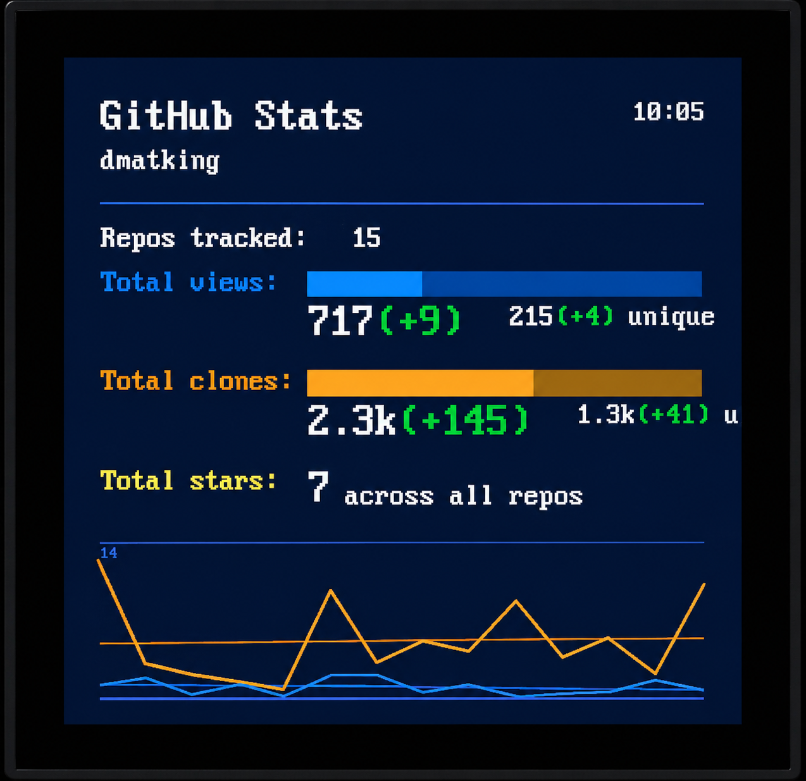
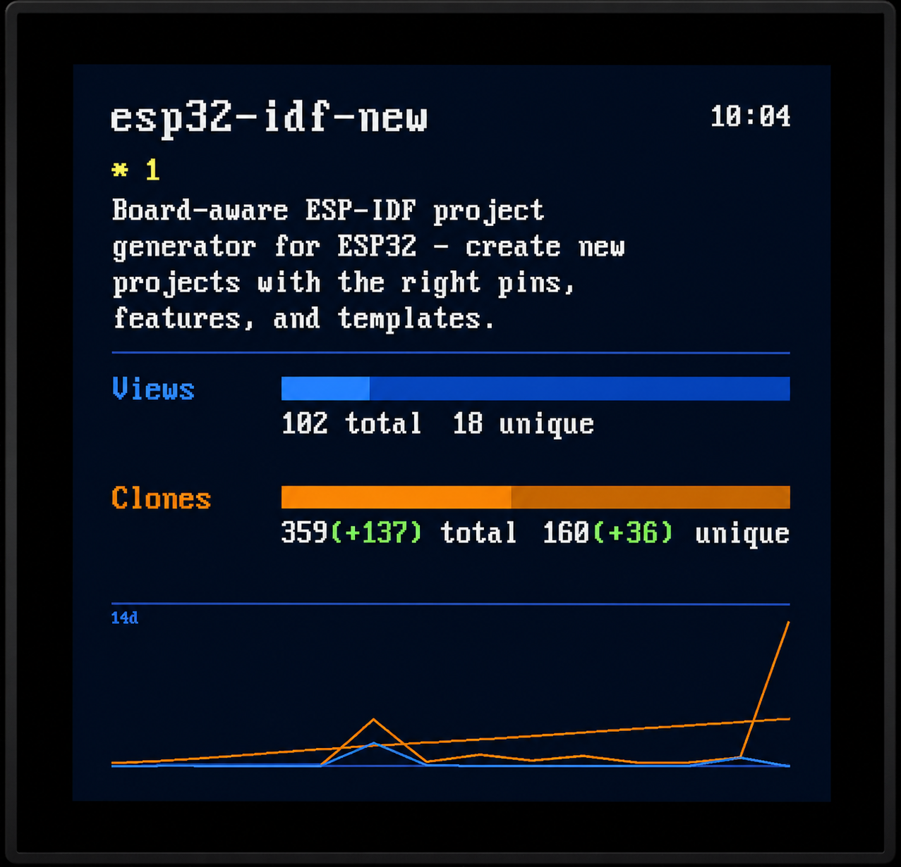

# esp32-gh-dashboard

A GitHub repository traffic dashboard running on the **Waveshare ESP32-P4-WIFI6-Touch-LCD-4B** — a 720×720 MIPI-DSI display driven by an ESP32-P4 with WiFi via an onboard ESP32-C6 co-processor.

> For chip-level notes on the P4+C6 combination (esp_hosted init, SDIO, PSRAM, errata, etc.) see [esp32-notes](https://github.com/dmatking/esp32-notes).

The device fetches your GitHub repository traffic stats (views, unique visitors, clones) once a day and cycles through a summary screen followed by a per-repo detail screen for each of your repositories. An optional `repo_config.csv` in the traffic-log repo lets you control which repos appear on the display and which are counted in the totals.



## Features

- Summary screen: total views, clones, and stars across all repos
- Per-repo screens: split bars showing unique vs non-unique views and clones, stars/forks, description
- 14-day traffic history graph (views and clones with trend lines) on every screen
- 12-hour clock in the top-right corner of every screen
- Green `(+N)` delta indicators showing day-over-day increases
- BOOT button advances to the next screen immediately
- Daily refresh at a configurable local time (default: 6:00 AM)
- NTP time sync with configurable timezone (POSIX TZ string, DST-aware)
- Configurable screen cycle interval (default: 30 seconds)
- Optional `repo_config.csv`: opt-in display list and per-repo totals exclusions

## How it works

Traffic data is collected by a companion GitHub Action in [github-traffic-log](https://github.com/dmatking/github-traffic-log), which runs daily and appends stats to a CSV file. The dashboard fetches `latest.csv` (the last two days of data) on boot and at the configured refresh hour, computing true day-over-day deltas regardless of how long the device has been offline.

Repo names and descriptions are fetched via the GitHub GraphQL API. GitHub's traffic API only retains 14 days of history — the CSV log provides permanent accumulation beyond that window.

The dashboard also fetches an optional `repo_config.csv` from the traffic-log repo. If present, it switches the per-repo cycling screens to opt-in mode — only repos listed with `show=1` get their own screen. Repos not listed are hidden from cycling but still counted in the summary totals. A separate `exclude_totals` flag removes a repo from the totals and leaderboard entirely. If the file is absent, all repos are shown with no filtering.

## Hardware

| Part    | Details                               |
| ------- | ------------------------------------- |
| Board   | Waveshare ESP32-P4-WIFI6-Touch-LCD-4B |
| Display | 720×720 MIPI-DSI (ST7703 controller)  |
| WiFi    | ESP32-C6 co-processor via SDIO        |
| Flash   | 16 MB                                 |
| PSRAM   | HEX mode, 200 MHz                     |

## Requirements

- [ESP-IDF](https://github.com/espressif/esp-idf) v5.5.3 or later
- A GitHub [personal access token](https://github.com/settings/tokens) with `repo` scope
- The [github-traffic-log](https://github.com/dmatking/github-traffic-log) companion repo set up and collecting data

## Setup

### 1. Set up the traffic log

Fork or copy [github-traffic-log](https://github.com/dmatking/github-traffic-log) and follow its README to add your `TRAFFIC_TOKEN` secret and set `REPOS_MODE`. Run the workflow once manually to generate the initial `latest.csv`.

### 2. Clone this repo

```bash
git clone <repo-url> esp32-gh-dashboard
cd esp32-gh-dashboard
```

### 3. Set target

```bash
idf.py set-target esp32p4
```

### 4. Configure credentials

Create or add to `~/.esp_creds` (loaded automatically by the build system, never committed):

```
CONFIG_WIFI_SSID="YourNetwork"
CONFIG_WIFI_PASS="YourPassword"
CONFIG_GH_TOKEN="ghp_yourPersonalAccessToken"
```

All other settings can be left at defaults or adjusted via `idf.py menuconfig` → **Dashboard Configuration**:

| Option                   | Default                  | Description                                |
| ------------------------ | ------------------------ | ------------------------------------------ |
| `DASHBOARD_TIMEZONE`     | `CST6CDT,M3.2.0,M11.1.0` | POSIX TZ string (US Central w/ DST)        |
| `DASHBOARD_REFRESH_HOUR` | `6`                      | Hour of day to re-fetch stats (local time) |
| `DASHBOARD_CYCLE_SEC`    | `30`                     | Seconds between screen transitions         |
| `GH_USERNAME`            | `dmatking`               | Your GitHub username                       |

Common timezone strings:

```
CST6CDT,M3.2.0,M11.1.0   US Central
EST5EDT,M3.2.0,M11.1.0   US Eastern
MST7MDT,M3.2.0,M11.1.0   US Mountain
PST8PDT,M3.2.0,M11.1.0   US Pacific
UTC0                      UTC
```

### 5. Build and flash

```bash
idf.py build
idf.py -p /dev/ttyACM0 flash
```

Monitor output:

```bash
idf.py -p /dev/ttyACM0 monitor
```

## Filtering repos

Create `repo_config.csv` in the root of your `github-traffic-log` repo to control what appears on the display:

```csv
repo,show,exclude_totals
esp32-gh-dashboard,1,0
my-other-project,1,0
profile-repo,0,1
```

| Column           | Effect                                                                 |
| ---------------- | ---------------------------------------------------------------------- |
| `show=1`         | Repo gets a per-repo cycling screen                                    |
| `show=0`         | No cycling screen, but still counted in summary totals                 |
| `exclude_totals=1` | Removed from summary totals, stars count, and top-clones leaderboard |

**If the file is absent**, all repos are shown and nothing is excluded — fully backward-compatible.

**If the file is present**, only repos with `show=1` appear in the cycling screens. Repos not listed at all are hidden from cycling but counted in totals. New repos you push will appear in totals automatically without touching the file; add them with `show=1` when you want them on the display.

## Project structure

```
main/
  main.c                              App entry point, scheduling, button handling
  board_waveshare_wvshr_p4_720_touch.c  Display init and pixel API
  board_interface.h                   Board abstraction (pixel, flush, dimensions)
  dashboard.c / .h                    Screen renderer
  github_api.c / .h                   GraphQL client for repo metadata
  traffic_csv.c / .h                  CSV fetcher and parser for traffic data
  wifi.c / .h                         WiFi + esp_hosted init
  font8x16.c / .h                     Bitmap font renderer
  Kconfig.projbuild                   menuconfig options
components/
  esp_lcd_st7703/                     ST7703 MIPI-DSI panel driver
sdkconfig.defaults                    ESP32-P4 + Waveshare board settings
partitions.csv                        16 MB flash layout (4 MB app partition)
```

## License

MIT — see [LICENSE](LICENSE).
