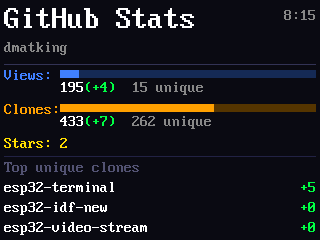
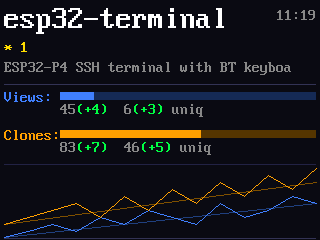
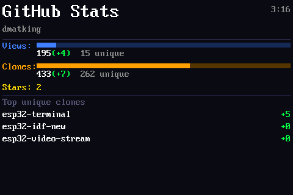
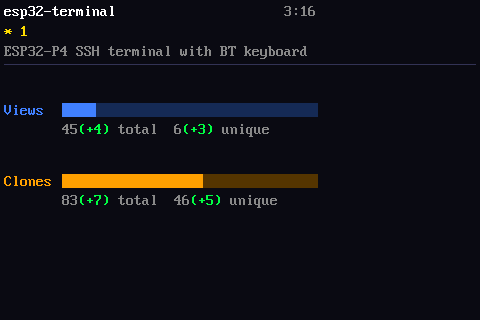
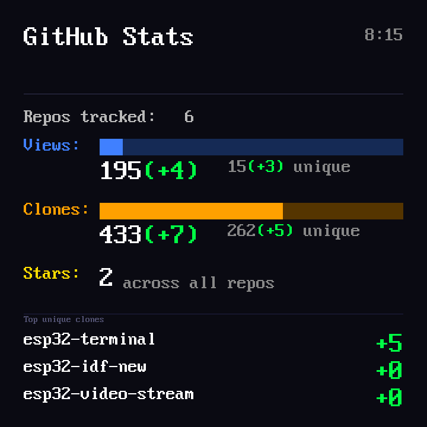
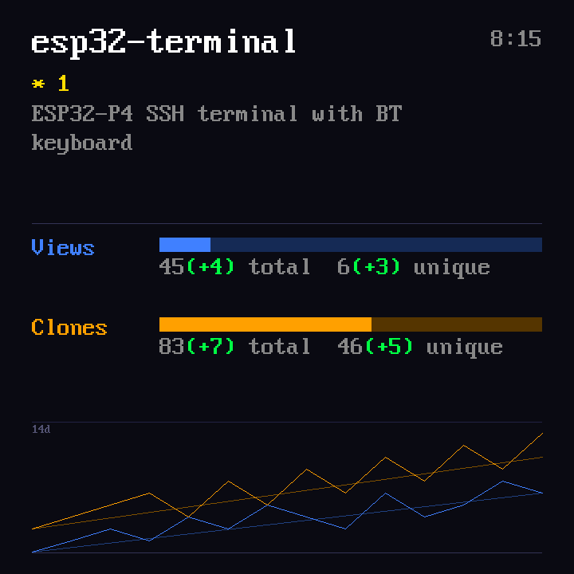

# esp32-gh-dashboard

A GitHub traffic dashboard built primarily for the wildly popular **"CYD"** family (Cheap Yellow Display — the cheap ESP32-with-screen modules). Also runs on the higher-end Waveshare ESP32-P4-WIFI6-Touch-LCD-4B for the 720×720 round-display crowd. Shows views, clones, stars, and day-over-day deltas for all your repositories, cycling through a summary screen and a per-repo detail screen for each.

&nbsp;

<details><summary>CYD 3.5" screenshots</summary>

&nbsp;

The 3.5" board renders the same layout as the 2.8" in the top-left, with empty space below — easy to retune later if you want to use the full 480×320 area.

</details>

<details><summary>Waveshare P4 screenshots</summary>

&nbsp;

</details>

---

## What you need

- One of the supported boards (full list below)
- A GitHub classic personal access token with `repo` scope — [how to create one](https://docs.github.com/en/authentication/keeping-your-account-and-data-secure/managing-your-personal-access-tokens#creating-a-personal-access-token-classic)
- The [github-traffic-log](https://github.com/dmatking/github-traffic-log) companion repo set up and running (collects your traffic data daily)

---

## 1. Flash the firmware

Pick the binary matching your board:

| Board | Chip | Display | Binary |
| ----- | ---- | ------- | ------ |
| **CYD 2.8" ILI9341** (E32R28T/E32N28T) — recommended | ESP32 | 320×240 | [`esp32-gh-dashboard-cyd28-flash.bin`](releases/esp32-gh-dashboard-cyd28-flash.bin) |
| **CYD-S3 2.8" ILI9341** (ES3C28P) | ESP32-S3 | 320×240 | [`esp32-gh-dashboard-cyd28s3-flash.bin`](releases/esp32-gh-dashboard-cyd28s3-flash.bin) |
| **CYD 3.5" ST7796** (E32R35T/E32N35T) | ESP32 | 480×320 | [`esp32-gh-dashboard-cyd35-flash.bin`](releases/esp32-gh-dashboard-cyd35-flash.bin) |
| Waveshare ESP32-P4-WIFI6-Touch-LCD-4B | ESP32-P4 | 720×720 | [`esp32-gh-dashboard-p4-flash.bin`](releases/esp32-gh-dashboard-p4-flash.bin) |

### Option A — Web flasher (easiest, no install required)

Open **[ESPConnect](https://thelastoutpostworkshop.github.io/ESPConnect/)** in Chrome or Edge, plug your board in, and flash the binary you downloaded above.

<details><summary>Step-by-step instructions (click to expand)</summary>

> **Use Chrome or Edge.** Firefox/Safari don't support the Web Serial API the flasher needs.

1. **Download** the right binary for your board from the table above (right-click → Save Link As).
2. **Plug the board into your computer.** Most CYDs use a CH340/CH9102 USB-serial chip — on Windows you may need the [CH340 driver](https://www.wch-ic.com/downloads/CH341SER_EXE.html). macOS and modern Linux usually work out of the box.
3. **Open [ESPConnect](https://thelastoutpostworkshop.github.io/ESPConnect/)** in Chrome or Edge.
4. **Click "Connect Esp"** (the green button). A browser dialog will list serial ports — pick the one labeled `USB-SERIAL CH340`, `CP210x`, or similar (likely the only one if you don't have other USB-serial devices plugged in). Click *Connect*.
   - *Nothing in the dialog?* Unplug and replug the board, and confirm your USB cable is a **data cable**, not charge-only. Try a different port.
5. **Wait for the chip to be detected** — the flasher will print a line like `Detected ESP32` (or `ESP32-P4`) and show offset fields below.
6. **Set the firmware file at offset `0x0`:**
   - In the first row, set the offset to **`0x0`** (zero — *not* the default 0x1000).
   - Click **Choose File** and pick the `.bin` you downloaded in step 1.
   - You can ignore any other offset rows — the merged binary already contains the bootloader + partition table + app at their correct internal offsets.
7. **Click "Erase Flash"** (optional but recommended for a clean install).
8. **Click "Program"** and wait — the progress bar takes about 20-30 seconds.
9. When done, **unplug and replug the board** (or hit the RST button if your CYD has one). The dashboard should boot and display the *WiFi Setup* screen.

**Stuck on "Connecting..." or `Failed to connect`?** Some ESP32 dev boards need to be put into download mode manually: hold the **BOOT** button (sometimes labeled IO0) while pressing-and-releasing **RESET** (sometimes EN), then release BOOT. Then retry step 4.

</details>

### Option B — esptool (Python)

For the CYD 2.8" (classic ESP32):
```bash
pip install esptool
python -m esptool --chip esp32 -b 460800 \
  --before default_reset --after hard_reset \
  write_flash 0x0 releases/esp32-gh-dashboard-cyd28-flash.bin
```

For the CYD-S3 2.8" (ESP32-S3):
```bash
python -m esptool --chip esp32s3 -b 460800 \
  --before default_reset --after hard_reset \
  write_flash 0x0 releases/esp32-gh-dashboard-cyd28s3-flash.bin
```

For the CYD 3.5" (classic ESP32):
```bash
python -m esptool --chip esp32 -b 460800 \
  --before default_reset --after hard_reset \
  write_flash 0x0 releases/esp32-gh-dashboard-cyd35-flash.bin
```

For the Waveshare P4:
```bash
python -m esptool --chip esp32p4 -b 460800 \
  --before default_reset --after hard_reset \
  write_flash 0x0 releases/esp32-gh-dashboard-p4-flash.bin
```

---

## 2. First-boot setup

On first boot, the device creates a WiFi access point called **GithubDashboard**.

1. Connect your phone or laptop to **GithubDashboard**
2. A setup page should open automatically — if it doesn't, open a browser and go to **http://192.168.4.1/**
3. Fill in the form:
   - **WiFi Network** and **Password**
   - **GitHub Username** and **GitHub Token**
   - **Timezone** — pick from the dropdown, or enter a custom POSIX string
   - **Daily refresh hour** — what hour (0–23) to fetch fresh data each day (default: 6)
   - **Screen cycle time** — seconds between screens (default: 30)
4. Tap **Save & Connect**

The device saves your settings and connects to your WiFi. Subsequent boots connect directly.

**To change any setting**:

- **CYD**: re-flash the binary to clear settings (no button-triggered re-provisioning yet). Or, if you've entered a bad GitHub token, the device detects the auth failure on its next fetch and drops you back into the setup page automatically with a "GitHub Auth Failed" title — WiFi creds are preserved.
- **Waveshare P4**: hold the **BOOT button for 3 seconds** while the device is starting up. The setup page reopens with your existing values pre-filled — change only what you need and tap Save & Connect again.

---

## 3. Optional: filter which repos appear

Copy [`repo_config.csv`](repo_config.csv) to the root of your `github-traffic-log` repo and edit it to match your repositories:

| repo | show | exclude_totals | effect |
| ---- | ---- | -------------- | ------ |
| my-main-project | 1 | 0 | shown on display, counted in totals |
| old-experiment | 0 | 0 | hidden from display, counted in totals |
| profile-readme | 0 | 1 | hidden from display, excluded from totals and leaderboard |

If the file is absent, all repos are shown and nothing is excluded.

---

For build instructions, project architecture, and hardware details see [BUILDING.md](BUILDING.md).
