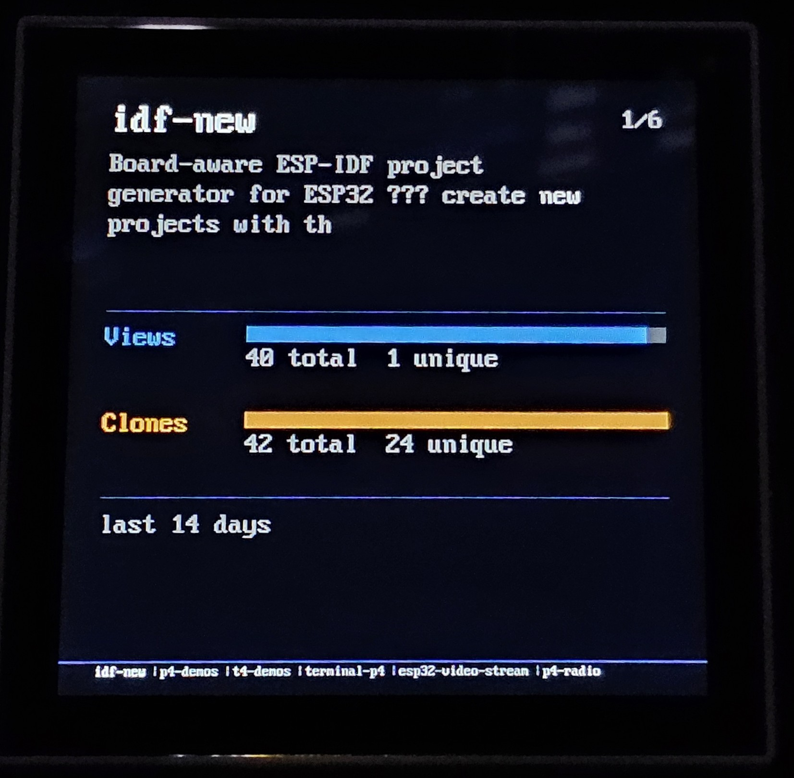

# gh-stats-dashboard

A GitHub repository traffic dashboard running on the **Waveshare ESP32-P4-WIFI6-Touch-LCD-4B** — a 720×720 MIPI-DSI display driven by an ESP32-P4 with WiFi via an onboard ESP32-C6 co-processor.

The device fetches your GitHub repository traffic stats (views, unique visitors, clones) once a day via the GitHub REST API and cycles through a summary screen followed by a per-repo detail screen for each of your repositories.



## Features

- Summary screen: total views, clones, unique visitors across all repos
- Per-repo screens: views and clone bars with unique counts, stars/forks, description
- Green `+` indicator when stats have increased since the last fetch
- Ticker bar showing all repo names at the bottom of each screen
- Daily refresh at a configurable local time (default: 6:00 AM)
- NTP time sync with configurable timezone (POSIX TZ string, DST-aware)
- Configurable screen cycle interval (default: 30 seconds)

## Hardware

| Part | Details |
|------|---------|
| Board | Waveshare ESP32-P4-WIFI6-Touch-LCD-4B |
| Display | 720×720 MIPI-DSI (ST7703 controller) |
| WiFi | ESP32-C6 co-processor via SDIO |
| Flash | 16 MB |
| PSRAM | HEX mode, 200 MHz |

## Requirements

- [ESP-IDF](https://github.com/espressif/esp-idf) v5.3 or later (tested on v5.5.1)
- A GitHub [personal access token](https://github.com/settings/tokens) with `repo` scope (needed for traffic API)

## Setup

### 1. Clone

```bash
git clone <repo-url> gh-stats-dashboard
cd gh-stats-dashboard
```

### 2. Set target

```bash
idf.py set-target esp32p4
```

### 3. Configure credentials

Create or add to `~/.esp_creds` (loaded automatically by the build system, never committed):

```
CONFIG_WIFI_SSID="YourNetwork"
CONFIG_WIFI_PASS="YourPassword"
CONFIG_GH_TOKEN="ghp_yourPersonalAccessToken"
```

All other settings can be left at defaults or adjusted via `idf.py menuconfig` → **Dashboard Configuration**:

| Option | Default | Description |
|--------|---------|-------------|
| `DASHBOARD_TIMEZONE` | `CST6CDT,M3.2.0,M11.1.0` | POSIX TZ string (US Central w/ DST) |
| `DASHBOARD_REFRESH_HOUR` | `6` | Hour of day to re-fetch stats (local time) |
| `DASHBOARD_CYCLE_SEC` | `30` | Seconds between screen transitions |
| `GH_USERNAME` | `dmatking` | Your GitHub username |

Common timezone strings:

```
CST6CDT,M3.2.0,M11.1.0   US Central
EST5EDT,M3.2.0,M11.1.0   US Eastern
MST7MDT,M3.2.0,M11.1.0   US Mountain
PST8PDT,M3.2.0,M11.1.0   US Pacific
UTC0                      UTC
```

### 4. Build and flash

```bash
idf.py build
idf.py -p /dev/ttyACM0 flash
```

Monitor output (handles the brief USB JTAG reconnect during boot):

```bash
idf.py -p /dev/ttyACM0 monitor
```

## How it works

On boot the device connects to WiFi, syncs the clock via NTP, fetches stats from the GitHub API, and begins cycling through screens. Each day at the configured hour it re-fetches and compares against the previous values — any metric that increased gets a green `+` indicator.

GitHub's traffic data updates roughly once per day (around midnight UTC), so fetching more than once a day returns the same numbers.

## Project structure

```
main/
  main.c                              App entry point, scheduling logic
  board_waveshare_wvshr_p4_720_touch.c  Display init and pixel API
  board_interface.h                   Board abstraction (pixel, flush, dimensions)
  dashboard.c / .h                    Screen renderer
  github_api.c / .h                   GitHub REST API client
  wifi.c / .h                         WiFi + esp_hosted init
  font8x16.c / .h                     Bitmap font renderer
  Kconfig.projbuild                   menuconfig options
components/
  esp_lcd_st7703/                     ST7703 MIPI-DSI panel driver
sdkconfig.defaults                    ESP32-P4 + Waveshare board settings
partitions.csv                        16 MB flash layout (4 MB app partition)
```

## License

MIT — see [LICENSE](LICENSE).
